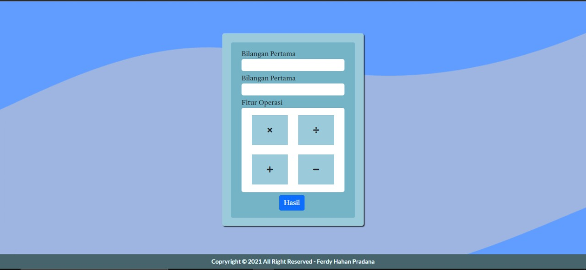

# KalKulator Sederhana
## :notebook: Apa itu Kakulator sederhana?
Kalkulator sederhana ini adalah kalkulator yang dapat menambahkan 2 bilangan dengan operasi:
1. **penjumlahan(+)**
2. **pengurangan(-)**
3. **perkalian(*)**
4. **pembagian(/)**
## :camera: Cuplikan Screenshoot Website

## :key: License
- Copryright © 2021 All Right Reserved - Ferdy Hahan Pradana
---
:pushpin: Created by Ferdy Hahan Pradana
